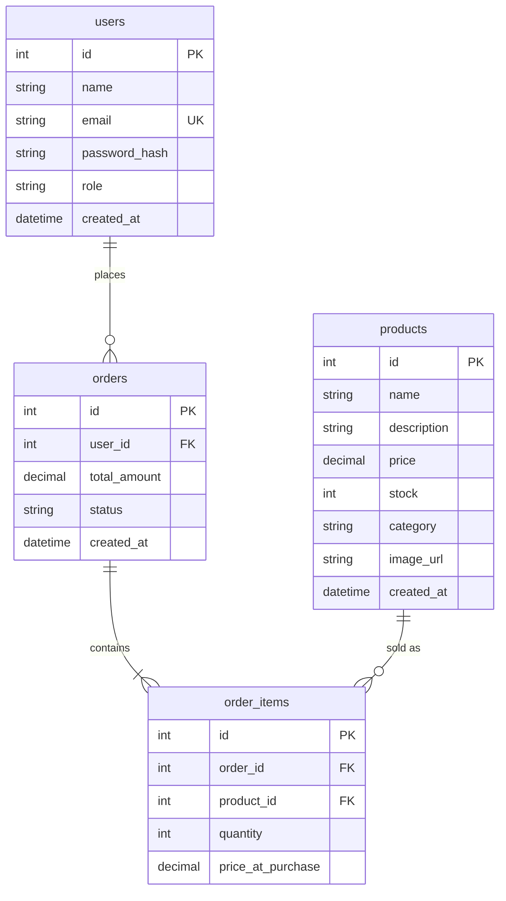

# ER diagram (MySQL)

```mermaid
erDiagram
  users ||--o{ orders : places
  orders ||--|{ order_items : contains
  products ||--o{ order_items : "sold as"

  users {
    int id PK
    string name
    string email UK
    string password_hash
    string role
    datetime created_at
  }

  products {
    int id PK
    string name
    string description
    decimal price
    int stock
    string category
    string image_url
    datetime created_at
  }

  orders {
    int id PK
    int user_id FK
    decimal total_amount
    string status
    datetime created_at
  }

  order_items {
    int id PK
    int order_id FK
    int product_id FK
    int quantity
    decimal price_at_purchase
  }
```

`price_at_purchase` is copied at checkout so later price edits do not rewrite history.
